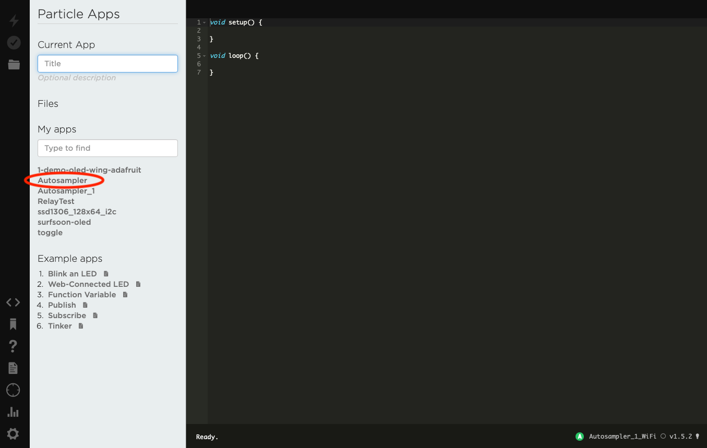
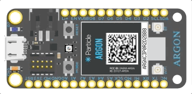

# Programming the Autosampler

The easiest way to flash new code onto the Autosampler - e.g. if you want to change the pump timings - is to the the online programmer:

[build.particle.io](http://build.particle.io)

## Editing the code

One you have logged in you will see a webpage like this. Click on the name of the application you want to edit and it will take you to the code. In this case we want the AutoSampler app.

You can now make whatever changes you like.

 **Remember to keep a backup if you make any big changes!**

*(If you are going to make big changes - e.g. beyond [updating the pump timings](./Pump Timings.md)  - it probably better to use the desktop programmer and git. This way you keep a backup of all your changes and it is easy to undo any mistakes.)*

## Re-flashing the Autosampler

One you have made your changes you are ready to send the new code to the device.

The Autosampler bust be connected to the internet to be reprogrammed. Instructions for how to do this are [here.](../RemoteOps.md)

<u>Select the device to re-program</u>

1. Check that the name device you want to program is shown in the bottom right corner.
2. If you need to change the device, you can either click on this name, or on the "target" symbol on the lower left of the screen (circled in red)

<u>Complie the code and send it to the Autosampler</u>

3. Click the "Tick" symbol on the top left (circled green) to complie the code. This will take a minute or so.  If you made no mistakes you shuold get a `Code verified! Great work` message at the bottom.

4. Click the "Lightening" symbol on the top left to send the complied code to the Autosampler. This will also take a minute or so. 

5. The AutoSampler should start flashing magenta as it recieved the update. once it has updated it will restart and be ready for use.
   

   