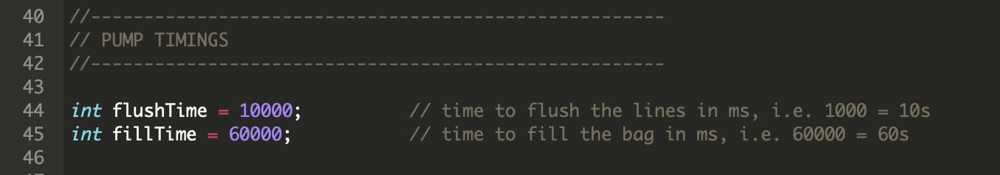

# Setting the pump timings

The timers that control how long the pumps flush the lines and then fill the bags are hard coded.

By default they are set to a 10s flush and a 60s bag fill.  To change these update the desired times in milliseconds in the program code (lines 44 and 45) and then re-flash the device.

## How do I do this?

1. Make sure the Microcontroller is online - i.e. it as happily flashing cyan.