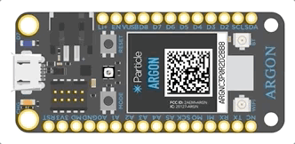
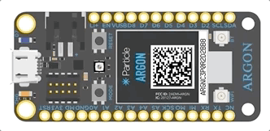

# How to set up the WiFi connection

**Academic/Public WiFi Networks have a tendancy to break things!**

**If at all possible only use a private WiFi network where you only need the Network Name and Password to login.**

**For remote sampling sites either use a cellular WiFi donlge, OR replace the Argon (WiFi) microcontroller with a Boron (2G/3G cellular)**

The easiest way to get the device online is to set it up using the Particle app on an apple iOS device (iPhone, iPad etc). The lab iPad should have the particle app installed.

There is a way to make it work using a custom website for any phone/computer - that's on the todo list, but not started yet.

## How to do it

1. Connect the lab iPad to the WiFi network (e.g. the ggrg WiFi in the lab).

2. Put the device into listening mode by holding the `MODE` button for three seconds, until the RGB LED begins blinking blue.

   

3. Open the Particle app, log into the group's account and select add new device.

4. Follow the on-screen instructions. 
   (i.e. photograph the QR code, type in the WiFi Password, etc.)

5. At one point the app will ask for the device name.  This *should* already be filled in. If not add the device's existing name (e.g. this one is called (Autosampler_1_WiFi)

6. It will now connect to the internet. When it has fiished the LED will blink cyan.

   

7. Done.

## Deleting all WiFi credentials

Deleting all old WiFi credentials can sometimes help stop problems if the device tries to connect to a WiFi network you don't expect.

To erase the stored Wi-Fi networks on your device, hold the `MODE` button until it blinks dark blue, then continue to hold it down for about ten seconds longer, until the RGB LED blinks blue rapidly, then release.

