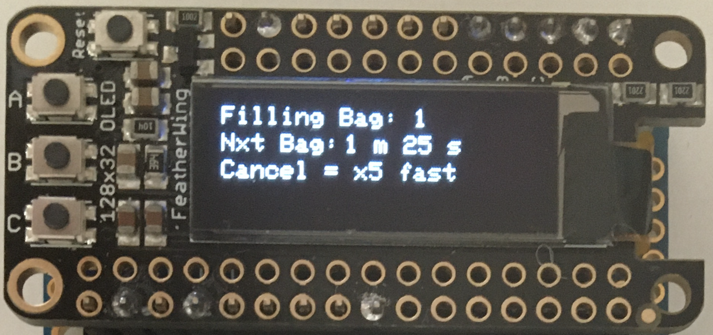
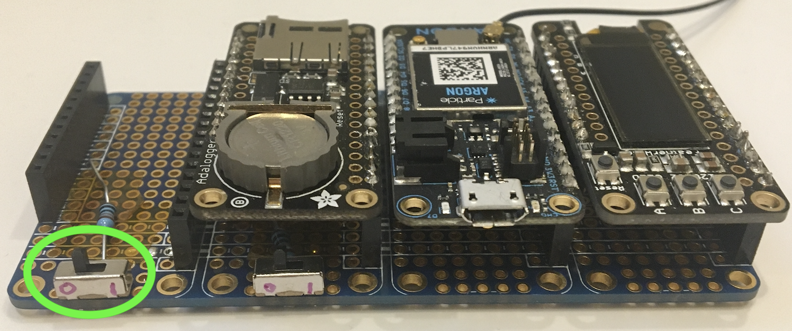

# Using the Sampler in-person

All basic things can be done by pressing the buttons next to the LCD screen.  When you first tun the sampler on the screen should look like this:

In general:

- the text on the top line is affected by pressing button `A`

- the middle line is controlled by pressing `B`
- the bottom line is controlled by pressing `C`

## Setting a sampling sequence

The Repeat and Begin times are set in the same way.

1. Press the button for the time you want to change - e.g. `A` for the Repeat time.  The screen will now show REPEAT.

2. Press `C` to cycle through the units, days, hours, minutes.  The selected unit will become a capital letter.

3. Press the row's button to change the time.  e.g. if you're changing the Repeat time and have highlighted H, press `A` to change the number of hours.  Continue pressing the button to get the correct value.  The time will rest to zero after reaching the limit.

   | Unit   | Increment |  Limit   |
   | :----- | :-------: | :------: |
   | Day    |   1 day   | 10 days  |
   | Hour   |  1 hour   | 24 hours |
   | Minute |  5 mins   | 60 mins  |

**insert photo of unit editing**

## Running a sampling sequence

### Starting the Sampler

If you are happy with the Repeat and Begin times and want to start the sampler press `C` five times fast. The screen should now look like this:

When the countdown timer reaches zero a bag will fill and the screen will display

### Stopping the sampler

The sampling sequence can be stopped at any time by pressing button `C` five (5) times fast. 

The screen will then revert to the default one at the top of this page.

# Resetting the Bag Counter

The sampler can only activate the valve for each bag once.  This means that once the sampler's counter gets to 12 (the max number of bags) it will stop.

Once someone has put new sample bags in place the counter can be reset using the switch underneath the connector to the relays for the valves:

Flick the switch to the ON position, then immediately back to OFF and the bag counter will reset to 1.

This switch will be replaced with a button with a guard in a later hardware version.