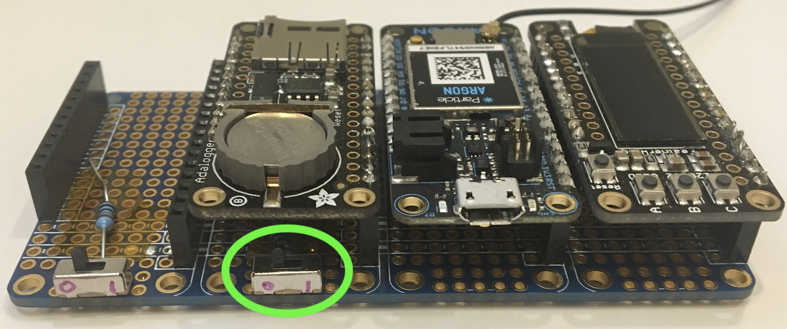
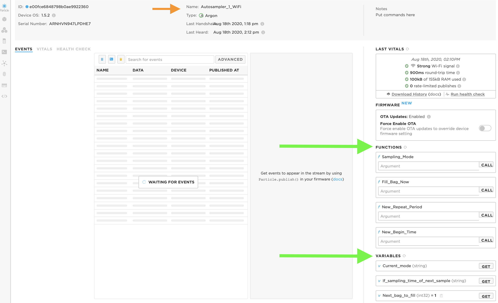
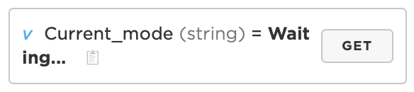
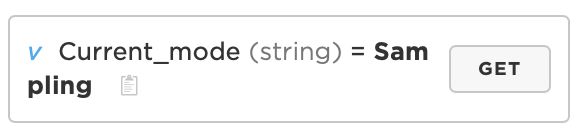
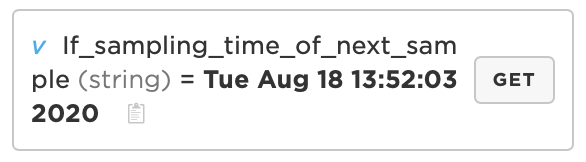
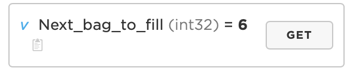

# Using the Sampler over the internet

The sampler can be connected to the internet to:

1. Update the bag filling interval
2. Start/stop a sampling sequence
3. Take a single sample

NOTE: you can take a single sample while a regular sequence is running so long as it doesn't clash with the sechduled sample.

## Connecting to the internet

For instructions on how to set to the WiFi connection see [here](Build  and Setup/WiFi Setup.md)

By default the sampler is normally DISCONNECTED from the internet, and the main LED should be pulsing white (it's a RGB LED so you can still see the other colors a bit).

To connect the sampler to the internet flick the switch under the battery to the ON position, then immediately back to OFF, the small LED near the USB connector should light up blue. 

At the next safe moment the sampler will try to connect to the internet.  The main LED will flash green while connecting to the local WiFi and then cyan when connecting to the device cloud.  When it has connected properly the main LED will slowly pulse cyan - it's like a very slow heartbeat.

**NOTE:** The sampler will NOT try to connect to the internet if it is mid sequence.  To go online, stop the sampling sequence, push the switch, and then re-start the sequence once online.

## Controlling via the Particle Cloud console

The Sampler exposes several variables to the cloud using the Particle.variable() API.  In principle any of these could be accessed using a REST API call however in practice it's probably easier to just use the Particle console: [console.particle.io](console.particle.io)

# Particle Console

If you open the particle console of the Autosampler you should see this: 

On the right hand side there is a list of the `Functions` that you can perform, and below them the `Variables` that you can read. 

 If you can't see them:

1. Make sure that you're on the console for the right piece of equipment by checking the device name
2. Refresh the `Functions` or `Variables` list by clicking on the little looped-arrow symbol to the right of the title.

## Variables
Click on the `GET` button to update the variables.

### Current_mode
This tells you the current mode of the device.  It will either say "Waiting..." if it is just sitting passively, or "Sampling" if the device has been activated and has a sequence of bag samples queued up.

### If_sampling_time_of_next_sample
This viable returns a date/time. The exact meaning depends on the mode (but is basically the same):
- "Waiting..." - **if you put the device into sampling mode** this is when the first sample will be taken.
- "Sampling" - This is when the next sample will be taken 

### Next_bag_to_fill
This variable returns the number of the next bag that will be filled.  The current hardware design only has a max of 12 bags, so once this number is bigger than 12 the timer will just keep counting but the pump will not turn on.

## Functions
Functions allow you to send information to the device to change its behaviour. //
To do this you type some text in the box and press the `CALL` button.

### Sampling_mode
This lets you change the device mode to start the automatic sampling.

- To start sampling type `Start`, and to stop type `Stop`.
- If the device recognises your command it will return a `1`, if something goes wrong it will return a `-1`.
- You can check that the mode has changed by getting the `Current_mode` variable (instructions above)

### Fill_bag_now
This function will make the device immediately fill a single bag providing some simple conditions have been met:
- There is an empty bag
- If in `Sampling` mode: The fill can be completed before the next queued bag sample is due to be taken.

To fill a bag type `Fill_Bag_Now` in the box an press the `CALL` button

### New_Repeat_or_Begin_Period
`Update_Repeat; Day ; Hour ; Minute` for example : `Update_Repeat;1;2;3`
returns 1
or

`Update_Begin; Day ; Hour ; Minute` for example : `Update_Begin;1;2;3`
returns 2

if fails it returns -1

If you are in `Sampling` mode this applies to the NEXT countdown, NOT the bag-fill that is currently counting down.
To update the current countdown you must exit `Sampling` mode, and then re-enter it using the **Sampling_mode** function (see above)

